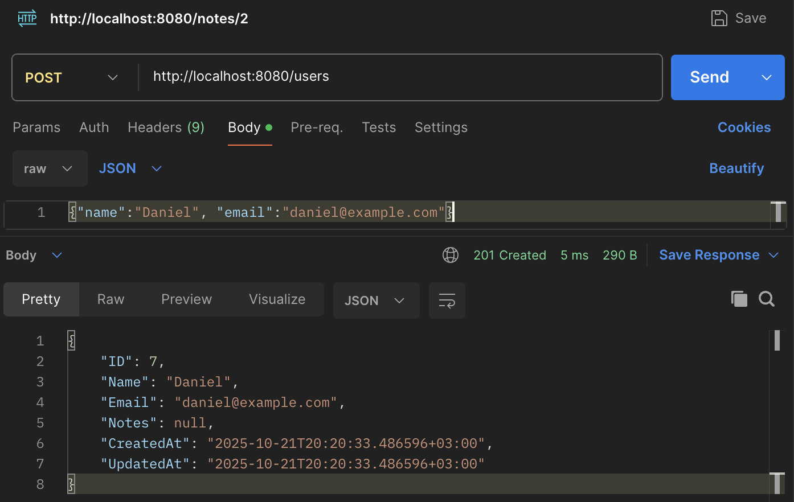
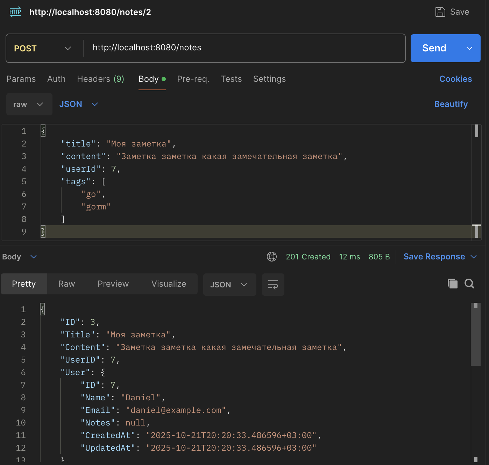
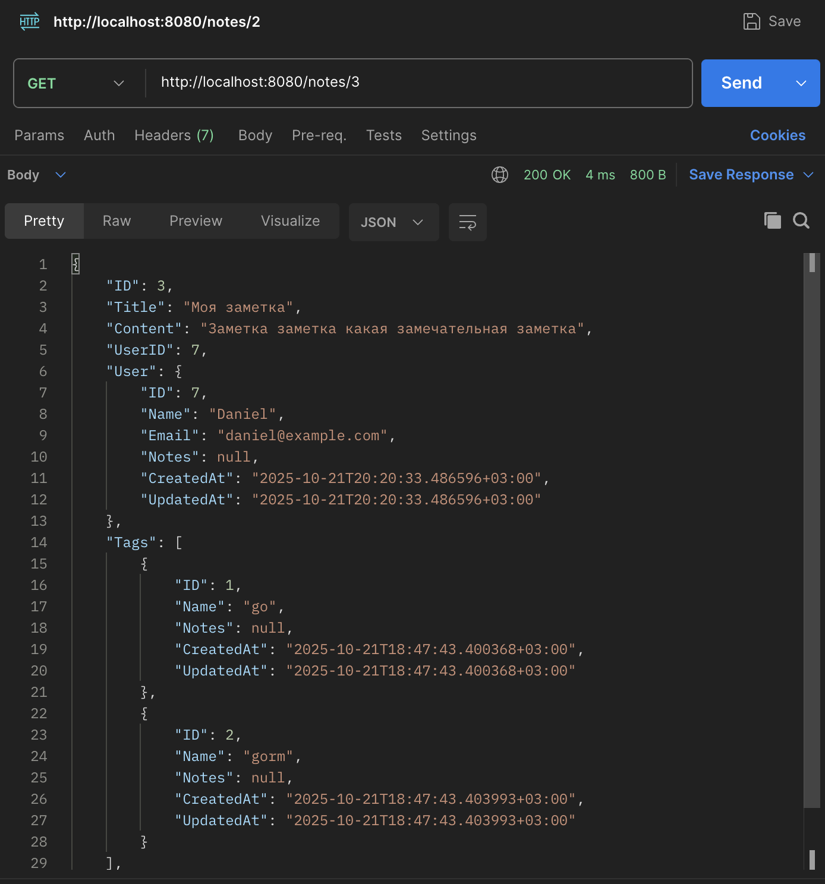
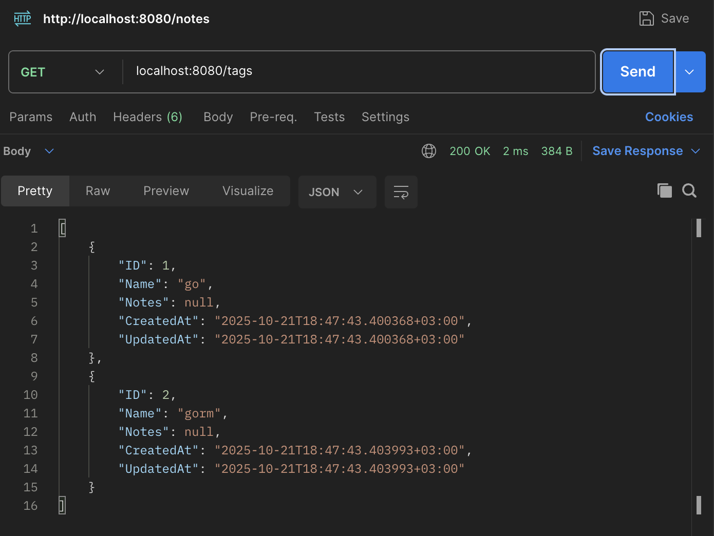
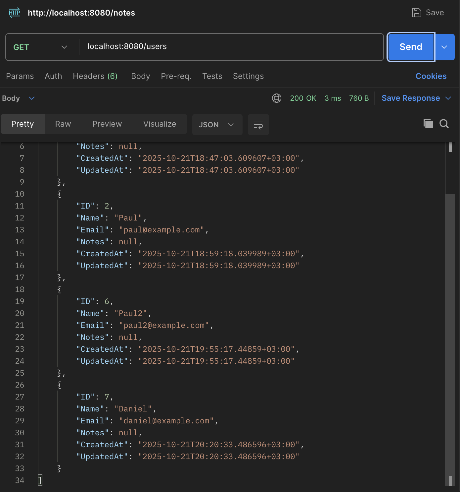
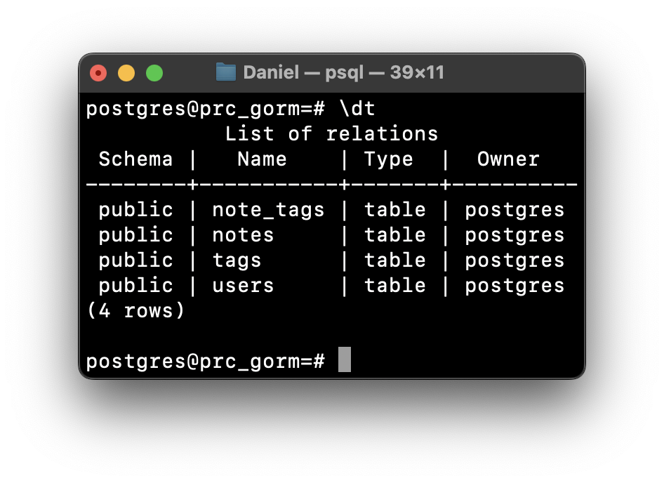

# Синицын Антон Григорьевич
## Практическая работа №6

### Краткое описание
ORM (Object–Relational Mapping) — это технология сопоставления объектно-ориентированных сущностей программы с таблицами реляционной базы данных

---

### 📌 Краткое описание
**ORM (Object–Relational Mapping)** — технология, позволяющая сопоставлять объектно-ориентированные сущности программы с таблицами реляционной базы данных.  
Это упрощает работу с БД, снижает количество шаблонного SQL и делает код более безопасным.

---

### 🚀 Зачем нужен ORM
- **Ускорение разработки** — меньше шаблонного SQL, код компактнее.  
- **Безопасность** — ORM автоматически использует параметризацию и защищает от SQL-инъекций.  
- **Поддержка миграций** — создание и обновление схем таблиц прямо из кода.  
- **Кросс-СУБД** — одинаковый код работает с PostgreSQL, MySQL, SQLite.

---

### ⚙️ Чем помогает GORM
- **CRUD** через GORM реализуется в несколько строк кода.  
- **Миграции (AutoMigrate)** позволяют автоматически создавать таблицы.  

---

> ### 💡 Сервер запущен  
> Реализованные эндпоинты:

| Метод | URL | Заголовок | Тело |
|-------|-----|-----------|------|
| POST  | my.domain:8080/users | Content-Type: application/json | `{"name":"...", "email":"..."}` |
| POST  | my.domain:8080/notes | Content-Type: application/json | `{"title":"...", "content":"...", "userId":..., "tags":["...", "..."]}` |
| GET   | my.domain:8080/notes/{id} | - | - |
| GET   | [my.domain/notes](http://79.164.43.106:2000/notes) | - | - |
| GET   | [my.domain/tags](http://79.164.43.106:2000/tags) | - | - |
| GET   | [my.domain/users](http://79.164.43.106:2000/users) | - | - |

---

### 📝 Создание пользователя
```bash
curl -X POST localhost:8080/users \
-H "Content-Type: application/json" \
-d '{"name":"Daniel", "email":"daniel@example.com"}'
```


---

### 📝 Создание заметки
```
curl -X POST localhost:8080/notes \
-H "Content-Type: application/json" \
-d '{"title":"Моя заметка", "content":"Заметка заметка какая замечательная заметка", "userId":7, "tags":["go", "gorm"]}'
```


---

### Получение заметки
```
curl localhost:8080/notes/3
```


---

### 📄 Получение всех заметок
```
curl localhost:8080/notes
```


---

### 🏷️ Получение всех тэгов
```
curl localhost:8080/tags
```


---

### 👥 Получение всех пользователей
```
curl localhost:8080/users
```


---

### 🗄️ Фрагмент схемы БД


---

### 📁 Дерево проекта
```
prc_gorm
├── README.md
├── cmd
│   └── server
│       └── main.go
├── go.mod
├── go.sum
├── internal
│   ├── db
│   │   └── postgres.go
│   ├── httpapi
│   │   ├── handlers.go
│   │   └── router.go
│   └── models
│       └── models.go
└── screenshots
    ├── ...
```
